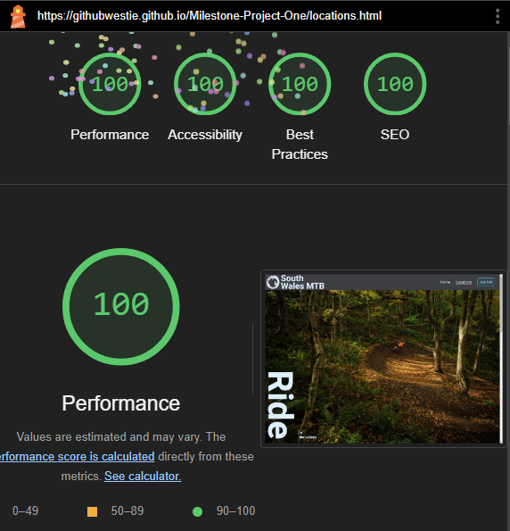

# **South Wales MTB**

## **Strategy - Description**

South Wales MTB is a club website that aims to help bring MTB riders from across the valleys together, keeping them motivated to ride their bikes and enjoy nature. It aims to grow the local mtb community, providing a safe way for mountain bikers to meet new people and get involved with regular club rides. 

**The site is live and can be found [here](https://githubwestie.github.io/Milestone-Project-One/)**

**The main goals for a MVP are:**

* Provide info about the club, promote the club ethos and attract new members

* Grow the community

* List a directory of current riding locations the club use

* Provide a means to sign up to be kept in the loop about club activity. Initially this will be via email.

## **User Experience - Scope**

**As a first time user I want:**

* To see if this club is for me - Club ethos, where they ride, skill level required, equipment required

* To know when the club rides

* Sign up

* Contact the club

**As a returning user/member I want:**

* To know when we are riding

* Sign up or login and access my account

* Use the shop

* Contact the club

## **Structure**

### **All Pages**

All pages will provide:

* A fixed nav-bar at the top of the screen for simple and convenient navigation

* A footer with contact links including links to email and social media platforms

### **Home / Landing Page**
Simple but attractive page with large hero image. Welcoming, calm and friendly with quick highlights of the core reasons to join and ride with the club.

#### Page Goals

* Attract new members

* Give a great first impression of the club

* Promote club ethos - All riders of all abilities are welcome

#### User Goals

* Find information

* Is this club for me?

* When and where does the group ride?

* How do I get involved?

### **Locations**

A list of riding locations used by the club, presented as cards. Each card gives a quick overview of difficulty and length with the ability to click through to a more detailed page about the area.

#### Page Goals

* Attract new members

* Provide more detailed information on club activity such as recent rides, trips away etc.

* Demonstrate that the club ethos is upheld during rides and that all riders of all abilities are welcome

#### User Goals

* Learn more about the club and gain a deeper understanding of the members as individuals

* Get a feel for the attitude toward mixed ability riding and the support that can be expected

* See what rides the members get up to outside of South Wales

### **Sign up**

A sign up screen where users can submit their email address to receive club updates and event information. In future will be used as a login to access account and account based features.

#### Page Goals

* Capture potential new members

* Provide a way for new members to submit their email address and be kept up to date with club updates and developments

#### User Goals

* Submit info and join the club

* Keep in touch with the club and be kept up to date with club activity

## **Skeleton**

### **Desktop**

### **Tablet**

### **Mobile**

## **Surface**

### **Features**

### **Navbar**

Each page is headed up by the navbar for simple and intuitive navigation. Small screens up to 768px utilise the smaller mobile menu. This menu eliminates cramping in the nav bar by reducing the logo down to the club icon (which floats slightly outside of the navbar to maintain a legible size) and replaces the text links with easily recognisable icons.

Larger screens use the full size navbar with full size logo, text links and a CTA styled like a button for the 'join us' link. The logo is also a link to the homepage and all links feature a subtle hover state to let the user know they are an interactive feature.

Both versions of the navbar are sticky to keep navigation simple, convenient and accessible at all times.

### **Hero Images**

Each page features a hero image chosen to reflect the character of riding in the valleys of South Wales, elicit an emotional response and create a quick connection with users.

#### Homepage Hero

The homepage hero image is chosen as it is such a typical and iconic sight in the valleys of South Wales. It has a calming yet alluring tone to a mountain biker as they know what hides amongst the trees. This was also a careful selection in terms of being identifiable with mountain biking but not scaring off potential club members with images of big jumps, drops or other features which may make them feel the club is exclusive to people of a high skill level.

The strong and small text to the side of the image is inspired by print media and is a familiar sight in MTB related publications.

This image also drove the choices on colour palette for the site. 

#### Locations Hero

With the locations hero I wanted to quickly convey an idea of what a typical ride with the club might look like whilst again not picking anything too scary so as to not be offputting to the more novice rider. In addition it gives a feel of being a small part of a much larger track and draws the user in to thinking about how the rest of the track might be, imaging themselves riding it and the sense of freedom that comes with that. The warmth of the image helps to make that visualisation positive.

#### Join Us Hero

As this image is the last chance to catch a potential new member I wanted this one to represent the fun of riding a bike. Wheelies are one of the most fun tricks in a mountain bikers bag and often one of the first learnt. As with the other hero images this one is unlikely to be off putting to those new to the sport but still illustrates the club ethos of riding for fun and not being too serious. 

### **Page Introductions**

Each page has a brief introduction to provide context to the page and some quick information. It also aims to answer some questions that new users would likely have when they first come to the site. These were kept short to not overload users with text heavy content.

### **Main Content**
#### Home Page

The home page features some core reasons why a user may want to join the club. This information is designed to be easily readable and quickly communicate the benefits of joining and riding with the club. Text is accompanied by images and backed up with icons to grab attention and engage the user, encouraging them to want to find out more.

#### Locations Page

The locations page features some of the most popular and often used areas by the club. The images tell a story about the type of riding that can be expected at each location and also show a variety of riding styles such as bike park features, smooth flowing descents and big jumps. These location cards quickly communicate that there is variety among the group and therefore, something that all riders of all abilities can enjoy.

#### Ready? Banner
 

For convenience a join button is positioned at the bottom of each page. If a user reaches the end of any page content and decides they have learnt enough and want to join there is no need for them to go looking for a way to join. This button is accompanied by a catchphrase that is recognisable to many mountain bikers and fits in with the lighthearted ethos of the club.

### Join Us!
 

For simplicity the only element on this page (aside from fixed elements such as nav and footer) is the sign up form. Here the user is able to submit their name and email to be added to the club and receive important information such as member only rides etc. As the form floats in the center of the page but I didnt want the image behind to be obscured the opacity is reduced but a blur added so that on smaller screens when the rider is behind the form the image isnt distracting or making the form difficult to read.

### **Footer**

At the bottom of each page is a consistent footer with links to social media and email. Should somebody wish to use these to find out more about the club or request more information, each link opens in a new tab so as to not permanently navigate the user away from the club website.

### **Future Feature Implementations**

#### **Ride Calendar** 
Provide a calendar with info about upcoming rides so members can plan meet ups easier and better organise rides depending on group size.

#### **Locations Info**
Each location card will be a link to its own page for information relating to the area it concerns. This would include info like number of tracks, technicality, length, terrain type and an embedded map with pin drop to the location.

#### **Blog**

A simple blog for detailing previous events involving the club such as club rides, trips away, races etc. Useful for potential club members to see what the club gets up to and encourage them to get involved. 

#### **Expandable Nav Menu**
As the site grows it will become impractical to keep adding icons to the mobile nav bar. A collapsable and expandable nav bar will provide a much better user exerience.

## **Deployment**

The site is deployed via GitHub Pages. Steps to deploy are as follows:

1. Log in to GitHub and select `Milestone-Project-One` from the repo list
2. Select `settings` from the top navigation bar
3. From the menu on the left select `Pages`
4. Under `Build and Deployment`, in the `Source` drop-down list, select `Deploy from branch`.
5. Still under `Build and Deployment`, in the `Branch` drop-down lists, select `Main` and `/(root)`
6. Click `Save`
7. The project will be built and a `url` and `button` will appear at the top of the page. Use one of these to navigate to the deployed project.

### **Run Locally**
### Clone from URL
1. Log in to GitHub and select `Milestone-Project-One` from the repo list
2. To the right side of the page fine the green `code` button and click to see the drop down menu.
3. Under the `HTTP` tab, select the URL or click the copy button to the right of the URL to copy.
4. Create a folder for the repo.
5. In your chosen IDE change the working directory to the directory chosen for the repo.
6. Open the git bash cli and type `git clone` followed by the copied URL
7. Wait for the repo to be cloned

## **Testing**

### W3C Validators

All HTML and CSS was tested using the W3C validation service. Some minor HTML syntax errors were found and rectified. CSS passed with no errors.

 
 

### Google Lighthouse Results

These results were obtained in an incognito window to avoid any Chrome extensions skewing results.

#### Desktop

#### Mobile

## **Credits**

### **Images**

* **Logo** image by Mert Gör on [Open Clipart](https://openclipart.org/)

    Modified by me in [GIMP](https://www.gimp.org/)

* **Home page hero** image by [Marita Kavelashvili](https://unsplash.com/@maritaextrabold)

    Downloaded from [Unsplash](https://unsplash.com/photos/aerial-photo-of-green-trees-ugnrXk1129g)

* **Connect** image by [Clement Delhaye](https://unsplash.com/@clementdelhaye)

    Downloaded from [Unsplash](https://unsplash.com/photos/man-in-red-helmet-riding-on-bicycle-during-daytime-NJQv0W6DHaM)

* **Discover** image by [Mauricio Gutiérrez](https://unsplash.com/@mauriciogutierreztello)

    Downloaded from [Unsplash](https://unsplash.com/photos/man-riding-bike-on-hill-under-white-sky-w3VMH-09ePw)

* **Learn** image used with kind permission of [Bike Park Wales](https://www.bikeparkwales.com/)

* **Travel** image by [Nick Rickert](https://unsplash.com/@nick_rickert)

    Downloaded from [Unsplash](https://unsplash.com/photos/red-chevrolet-crew-cab-pickup-truck-parked-beside-black-bicycle-F6lzAY7Nd28)

* **Locations hero** image by [Tim Foster](https://unsplash.com/@timberfoster)

    Downloaded from [Unsplash](https://unsplash.com/photos/brown-dirt-road-in-the-middle-of-forest-during-daytime-e0jQbe0tw3I)

* **BPW** image by [Luca Beani](https://unsplash.com/@pigiama)

    Downoaded from [Unsplash](https://unsplash.com/photos/man-in-black-jacket-riding-on-black-motorcycle-in-forest-during-daytime-N0XoACbFYok)

*  **Cwmcarn** image by [Graziano De Maio](https://unsplash.com/@grazianodemaio)

    Downloaded from [Unsplash](https://unsplash.com/photos/man-riding-bicycle-on-river-during-daytime-EhwpPCZIzf4)

*  **Afan** image by [Tim Foster](https://unsplash.com/@timberfoster)

    Downloaded from [Unsplash](https://unsplash.com/photos/man-riding-bike-qrIy8dBzCVU)

*  **Risca** image by [Tadeja Pavšič](https://unsplash.com/@tadejapavsic)

    Downloaded from [Unsplash](https://unsplash.com/photos/a-person-riding-a-bike-on-a-dirt-trail-in-the-woods-7Pn9ySITNWg)

*  **Wyllie** image by [Carlo von Reyher](https://unsplash.com/@c_v_r)

    Downloaded from [Unsplash](https://unsplash.com/photos/man-in-black-jacket-riding-bicycle-on-forest-during-daytime-x-NMfz8As04)

*  **Barry Sidings** image by [Adrien Vajas](https://unsplash.com/@adrien_vj)

    Downloaded from [Unsplash](https://unsplash.com/photos/man-in-orange-jacket-riding-on-black-mountain-bike-o3_3a_EyNnY)

### **Code**

*   Code borrowed from CSS Tricks and modified to stop autofill changing the background colour of form inputs. 

